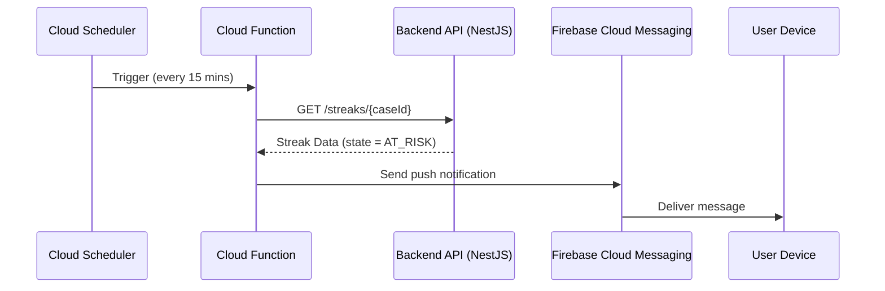

# Streaks Tracker


This is a fullstack web application for tracking user streaks, built with:

- **Frontend:** React + TypeScript + Vite
- **Backend:** NestJS
- **Styling:** TailwindCSS
- **Containerization:** Docker & Docker Compose

---

## Features

- Tracks daily user activity streaks
- Supports multiple cases with predefined activity data
- Smart logic for `COMPLETED`, `AT_RISK`, `SAVED`, `INCOMPLETE` states
- Clean, responsive UI based on provided Figma design

---

## Getting Started

### 1. Standard Local Development

#### Backend
```bash
cd apps/api
yarn install
yarn start:dev
```

#### Frontend
```bash
cd apps/web
yarn install
yarn dev
```

### 2. Docker-Based Setup
Make sure Docker and docker-compose are installed.
```bash
docker-compose up --build
```
Frontend: http://localhost:5173

Backend: http://localhost:3000

### 3. Running Tests
```bash
cd apps/api
yarn test
```


# Scheduled Streak Reminder System (GCP + Firebase)

Description of the architecture and implementation of a **scheduled push notification system** that reminds users when they are at risk of losing their streak, using **Google Cloud Scheduler**, **Firebase Cloud Messaging (FCM)**, and a **NestJS backend** as a data source.

---

## Overview

The notification flow is fully automated. A **Cloud Function** is triggered periodically (e.g., every 15 minutes) using **Cloud Scheduler**. It fetches streak data from the **NestJS backend**, determines which users are `AT_RISK`, and sends them push notifications via **FCM**.

---

## Technologies

- **Backend**: NestJS (streak data source)
- **Push Messaging**: Firebase Cloud Messaging (FCM)
- **Scheduler**: Google Cloud Scheduler
- **Compute**: Google Cloud Functions (Node.js)
- **Token Store**: Firestore or external DB

---

## Flow Summary



---

## Implementation Steps

### 1. NestJS Backend Endpoint

```ts
@Get('streaks/:caseId')
getStreak(@Param('caseId', ParseIntPipe) caseId: number): StreakResponseDto {
  return this.streaksService.getStreakData(caseId);
}
```

### 2. Cloud Scheduler (GCP)

Set up a cron job via GCP Console or CLI:

```bash
gcloud scheduler jobs create http streak-cron \
  --schedule="*/15 * * * *" \
  --uri="https://REGION-PROJECT.cloudfunctions.net/checkStreaks" \
  --http-method=GET \
  --time-zone="UTC"
```

### 3. Cloud Function (Node.js)

```ts
import * as admin from 'firebase-admin';
import fetch from 'node-fetch';
admin.initializeApp();

export const checkStreaks = functions.https.onRequest(async (req, res) => {
  const caseIds = [1, 2, 3]; // or fetched from DB

  for (const caseId of caseIds) {
    const response = await fetch(`https://backend-host.com/streaks/${caseId}`);
    const data = await response.json();

    const isAtRisk = data.days.some((d: any) => d.state === 'AT_RISK');
    if (!isAtRisk) continue;

    const tokens = await getFcmTokensForCase(caseId); // from Firestore

    const payload = {
      notification: {
        title: 'Keep your streak alive!',
        body: 'You’re about to lose your streak! Open the app now.',
      },
    };

    await admin.messaging().sendToDevice(tokens, payload);
  }

  res.status(200).send('Streaks checked. Notifications sent.');
});
```

---

## Security Notes

- Backend endpoint should be **read-only and protected**.
- Cloud Function URL should be **authenticated or restricted by IP**.
- FCM tokens must be stored securely and cleaned up when stale.

---

## Future Improvements

- Store caseId→userId mapping in Firestore
- Schedule regionally to reduce latency
- Add logging, error tracking, retries
- Only notify once per risk cycle


